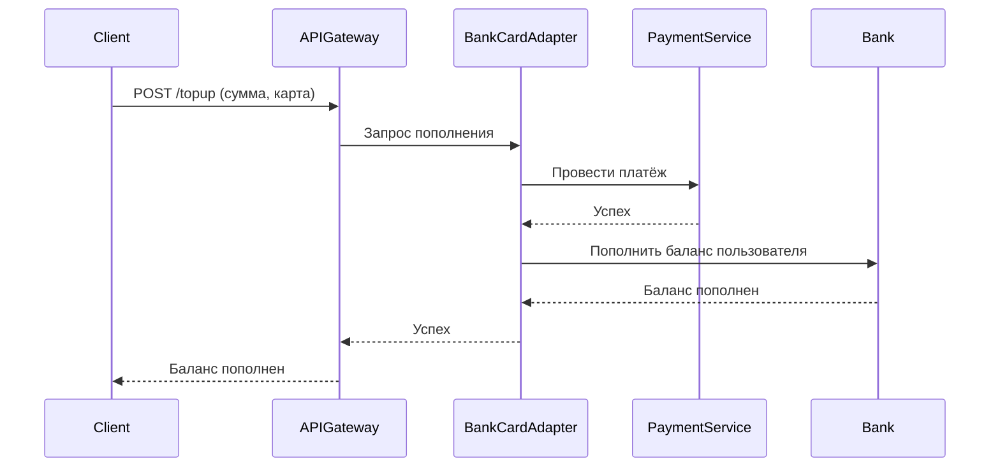
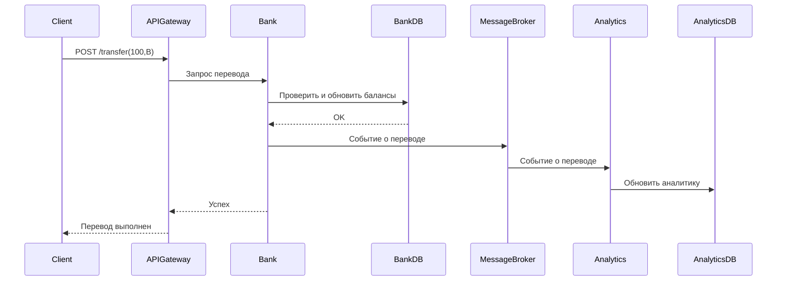

# Техническое решение проекта «Электронный кошелек»

## 1. Введение
- **Цель проекта:** реализовать прототип распределённой системы, позволяющей пользователям переводить друг другу деньги.  
- **Задачи:** закрепить теоретические основы распределённых систем (масштабируемость, отказоустойчивость, консистентность) через практическую реализацию.  
- **Основания для разработки:** учебный проект в рамках курса «Основы распределённых вычислений».  
- **Команда:** Слепенков Глеб, IT разнорабочий 

---

## 2. Глоссарий
| Термин        | Определение |
|---------------|-------------|
| Пользователь  | Зарегистрированный клиент системы. |
| Счет          | Учетная запись пользователя, предназначенная для управления денежными средствами | 
| Баланс        | Сумма средств на счёте пользователя. |
| Операция      | Совокупность действий, осуществляемых со счетами пользователей |
| Перевод       | Операция списания средств со счета одного пользователя с последующим их зачислением на счет другого пользователя. |
| Транзакция    | Атомарная последовательность операций над балансами. |
| API Gateway   | Точка входа для всех клиентских запросов. |
| Реплика       | Копия данных, поддерживаемая для отказоустойчивости. |
| Консистентность | Свойство, гарантирующее согласованность состояния данных между репликами. |

---

## 3. Функциональные требования
Система должна предоставлять следующие функции:
1. Пополнение счёта через внешний источник.  
2. Перевод денег между пользователями.  
3. Просмотр баланса и истории операций.  

---

## 4. Нефункциональные требования
- **Доступность:** 99.9%.  
- **Масштабируемость:** возможность увеличения числа узлов без модификации логики.  
- **Время отклика:** ≤ 200 мс в условиях локальной сети.  
- **Отказоустойчивость:** система должна продолжать работать при сбое одного из узлов.  
- **Консистентность:** отсутствие «двойных списаний».  

---

## 5. Пользовательские сценарии

### Сценарий: пополнение счёта через банковскую карту

1. Пользователь выбирает пополнение счёта в клиентском приложении и вводит сумму и данные банковской карты.
2. Клиентское приложение отправляет запрос на пополнение в систему.
3. Система проводит операцию в сторонней платежной системе и в случае успеха пополняет баланс пользователя
6. Пользователь видит обновлённый баланс в приложении.

```mermaid
usecaseDiagram
  actor User
  actor "BankCardAdapter" as Adapter
  actor "Платёжный сервис" as PaymentService

  User --> (Пополнение счёта)
  (Пополнение счёта) <-- Adapter
  Adapter --> (Платёжная операция)
  PaymentService --> (Платёжная операция)
  User --> (Просмотр баланса)
```

### Сценарий: перевод денег
1. Пользователь A инициирует перевод 100₽ пользователю B.  
2. Система проверяет баланс A.  
3. Если средств достаточно — выполняется транзакция, увеличивающая баланс B и уменьшающая баланс А.  
4. Пользователь B видит пополнение.  

```mermaid
usecaseDiagram
  actor User

  User --> (Перевод средств)
  User --> (Просмотр баланса)
```

### Сценарий: просмотр истории переводов
1. Пользователь запрашивает историю переводов через клиентское приложение.
2. Система возвращает список всех переводов пользователя (отправленных и полученных).

## 6. Архитектура

Основные компоненты:

1. API Gateway — входная точка в систему, отвечает за маршрутизацию клиентских запросов
2. Bank — основной сервис, отвечающий за проведение переводов и изменение баланса
3. BankCardAdapter — сервис, отвечающий за интеграцию с внешними платёжными системами (например, банковскими картами)
4. Bank DB — база данных сервиса Bank, транзакционная
5. Analytics — сервис, предоставляющий аналитические данные
6. Analytics DB — база данных сервиса Analytics, аналитическая
7. Message Broker — брокер сообщений, обеспечивающий асинхронную передачу данных из Bank в Analytics

## 7. Технические сценарии

### Сценарий: пополнение счёта через банковскую карту

1. Клиент отправляет в API Gateway запрос POST /topup с параметрами: сумма и данные карты.
2. API Gateway перенаправляет запрос в сервис BankCardAdapter.
3. BankCardAdapter инициирует операцию во внешнем платёжном сервисе.
4. После подтверждения успешного списания средств BankCardAdapter отправляет запрос на увеличение баланса пользователя в сервис Bank.
6. Bank сообщает об успешном пополнении BankCardAdapter, тот — API Gateway, а API Gateway — клиенту.



### Сценарий: выполнение перевода

1. Клиент отправляет в API Gateway запрос POST /transfer с параметрами: сумма и получатель.
2. API Gateway перенаправляет запрос в сервис Bank.
3. Bank обращается к транзакционной базе данных Bank DB для проверки и обновления балансов отправителя и получателя.
4. Bank DB подтверждает успешное выполнение транзакции.
5. Bank отправляет событие о переводе в Message Broker.
6. Analytics получает событие из Message Broker и обновляет аналитическую базу данных Analytics DB.
7. Bank сообщает API Gateway об успешном завершении операции.
8. API Gateway возвращает клиенту ответ о выполнении перевода.



## 8. План разработки и тестирования

### 8.1 Основной проект (MVP)
**Включает:**
- Реализация сервиса переводов между пользователями (Bank, API Gateway, интеграция с готовой транзакционной БД)
- Реализация сервиса Analytics (интеграция с готовой аналитической БД) для хранения и предоставления истории переводов
- Интеграция брокера сообщений (Message Broker) для передачи событий о переводах из Bank в Analytics
- Отображение истории переводов для пользователя через Analytics

**План разработки:**
1. Проектирование API для переводов и истории (история — через Analytics)
2. Реализация API Gateway (роутинг, валидация)
3. Реализация сервиса Bank (логика переводов)
4. Реализация сервиса Analytics (история переводов)
5. Интеграция с готовой транзакционной базой данных (Bank DB)
6. Интеграция с готовой аналитической базой данных (Analytics DB)
7. Интеграция с брокером сообщений (Message Broker)
8. Документирование API

**План тестирования:**
- Модульные тесты для логики переводов (Bank) и истории (Analytics)
- Интеграционные тесты взаимодействия Bank и Bank DB, Analytics и Analytics DB, взаимодействия через Message Broker
- Тесты API Gateway (валидные/невалидные запросы)
- Тесты на корректность истории переводов через Analytics
- Проверка граничных случаев (недостаточно средств, несуществующий пользователь и т.д.)

**Definition of Done (DoD) для MVP:**
- Все необходимые компоненты реализованы
- Все компоненты покрыты тестами

### 8.2 Расширенный проект (Advanced Scope)
**Включает:**
- Поддержка пополнения счёта через банковскую карту (BankCardAdapter, интеграция с внешним платёжным сервисом)
- Реализация отказоустойчивости и масштабируемости

**План разработки:**
1. Реализация механизма пополнения счёта через банковскую карту (BankCardAdapter)
2. Внедрение репликации и балансировки нагрузки (с использованием возможностей готовых решений)

**План тестирования:**
- Тесты на пополнение счёта через банковскую карту
- Тесты на отказоустойчивость (имитация сбоев)
- Тесты масштабируемости (нагрузочное тестирование)

**Definition of Done (DoD) для расширенного проекта:**
- Все необходимые компоненты реализованы
- Все компоненты покрыты тестами